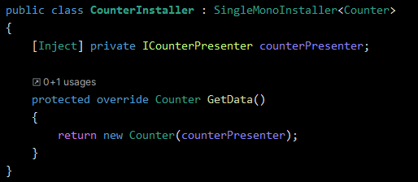

# Dependency Injector

This is a dependency injection framework (similar to Zenject and VContainer) and it is used for managing the dependencies along the program. Using it, we can reduce the coupling, the singletons, and we can create more modular systems.

## Install Guide

1. Add this package to your unity project by GitUrl on the PackageManager: [https://github.com/LaloBerro/UPM-DependencyInjector.git](https://github.com/LaloBerro/UPM-DependencyInjector.git)​
2. It is ready to use.

## How to use it

To use it, you need to understand 3 main concepts:

* DIContainers.
* Installers.
* Injector.

### DIContainers

These are where the classes instances are allocated, think of it as a Dictionary where the key is the class type and the value is the class instance. Then in the Injector section we are going to see where the container are created and used.

### Installers

These are on charge of create the instances of the classes. Exists 2 types:

* SingleMonoInstaller\<TObject>: to create only one instance of the class per DIContainer. If we try to install it multiple time, It will be thrown an error. In this example, we are installing the Counter class as a Single instance.

<figure><figcaption></figcaption></figure>

* MultipleMonoInstaller\<TObject>: to create multiples instance of a class per container, this is helpful when another class has an array dependency.

<figure><figcaption></figcaption></figure>

### Injectors

The injectors are the “context” where the classes are installed. Inside it, we have a DIContainer.&#x20;

The Injector is on charge to receive the installers and install them one by one. That process consist on check the installer and if it has a field with the attribute \[Inject], It will check in the container if it has the corresponding class instance and then set the field with it.&#x20;

No need to create a new injector every time you need it, you can use the MonoInjector, which the code is:

<figure><figcaption></figcaption></figure>

In order to use it, you only have to drag it into the scene.

### Using the framework

1. Create the installers for your classes.
2. In the scene, create a GameObject with the Injector component.
3. Then, as children, create the GameObjects with the MonoInstallers.
4. Drag into the MonoInjector the MonoInstallers.
5. And for last for initializing the Injector you can use a InjectorsInitializer component, which initialize the Injector on Awake().
6. That's it, the scene should look like this.

.png>)&#x20;

